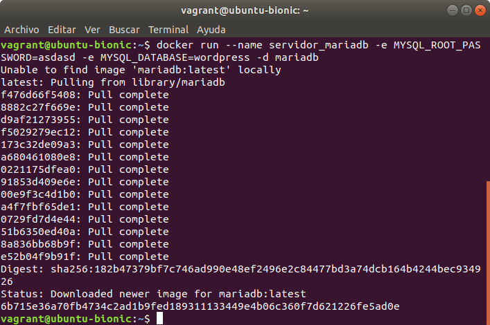
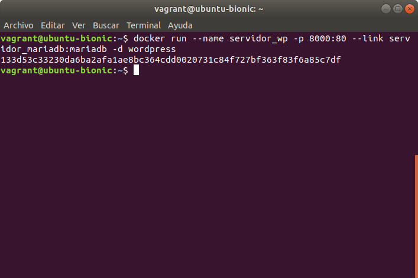
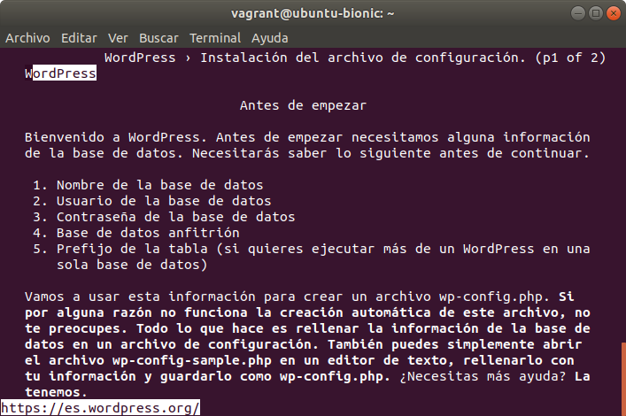

**Project: “Cloud Computing in European schools”**  

 Number: Project: 2017-1-ES01-KA202-038471

   

# Introduction to PaaS: develop, deploy, run and manage apps on the Cloud  

#### Disclaimer
&nbsp;&nbsp;&nbsp;  *"The European Commission support for the production of this publication does not constitute an endorsement of the contents which reflects the views only of the authors, and the Commission cannot be held responsible for any use which may be made of the information contained therein."*

#### Autores

&nbsp;&nbsp;&nbsp;  Este trabajo está realizado por Manuel Santos, José Antonio Busto, José María Parrilla y Víctor López bajo la licencia Creative Commons :    

### Objective
&nbsp;&nbsp;&nbsp; Platform as a Service (PaaS), is a cloud computing model that allows the users to develop, deploy, run and manage applications without taking care about the underlying layers. The alternatives used today focus on the use of containers which promote the **microservices based application** development approach (vs **monolithic applications**), because the different services into which we the application is separated can easily run in different containers. We will make a study of Docker, Kubernetes and OpenShift in order to develop, deploy, run and manage  microservices based applications.

&nbsp;&nbsp;&nbsp;This activity has been developed for developing the professional competence includes in the Erasmus+ project "Cloud Computing in European Schools".

# <big>Docker</big>

<h2>Instalación de Vagrant y VirtualBox </h2>

Para utilizar Docker, primero tenemos que instalar Vagrant. 
Vagrant es una herramienta gratuita de línea de comandos, disponible para Windows,  MacOS X y GNU/Linux, que permite generar entornos de desarrollo reproducibles y  poderlas compartir de forma muy sencilla. Para ello, Vagrant crea y configura máquinas  virtuales a partir de simples ficheros de configuración.

El comando para instalar Vagrant es:

 

 

Ahora que tenemos Vagrant, tenemos que instalar una máquina virtual. 
 
En este caso, nosotros usamos Virtualbox (es un software de virtualización para arquitecturas x86/amd64. Ofrece algunas funcionalidades interesantes, como la ejecución de máquinas virtuales de forma remota, por medio del Remote Desktop Protocol)

 

Una vez instalado Vagrant y Virtualbox, enlazaremos un sistema operativo y lo haremos funcionar en los siguientes puntos.

 

<h2>Instalación de Docker</h2>

Ahora que tenemos la máquina virtual, tenemos que añadirle un sistema operativo  y en este caso lo haremos con el siguiente comando:

 

 

En la imagen anterior cuando se ha instalado el sistema operativo, después 
aparece otra línea de comando que sirve para comprobar el sistema que hemos  instalado.

 

A continuación, haremos un cd $HOME para ir a nuestra carpeta y aquí crearemos 
la carpeta vagrant. Después tenemos que entrar en esta carpeta y dentro crear un archivo llamado Vagrantfile:

 

 

Dentro del archivo Vagrantfile ponemos la siguiente información:

 

 

Una vez tenemos hecho lo anterior, arrancamos la máquina:

 

 

Cuando ya está funcionando nos conectamos mediante el siguiente comando:

 

 

Para ver la versión de docker que tenemos ponemos docker version:

 
 
 

Por último, saldremos de la máquina y la apagaremos:

 

 

<h2>Ciclo de Vida de la Aplicación</h2> 

Lo primero que debemos hacer es crear una aplicación, en este caso vamos a   crear una página web llamada ‘index.html’, que va a ser servida por un servidor web,  que se ejecutará en un contenedor Docker, para ello crearemos una carpeta   ‘public_html’ que contendrá nuestra página web, utilizamos los siguientes   comandos:
 
 

Necesitaremos utilizar un fichero Dockerfile en el que definiremos como vamos a  crear nuestra imagen, la crearemos con este comando:  
 
 

 Dentro de este fichero indicamos:  
-Qué imagen base utilizaremos 
-Qué paquetes vamos a instalar 
-La página de la que copiamos nuestro código fuente 
-Indicamos el servicio que ejecutará el contenedor   

Editaremos el Dockerfile tal y como se muestra en la siguiente imagen:
 

 

Ahora crearemos una imagen, utilizando el siguiente comando: 

 

Podemos listar todas las imágenes que tenemos creadas con el comando que se muestra a continuación
 

 

Creamos y ejecutamos un contenedor y lo listamos para ver si realmente si han creado los contenedores
 

 

Comprobaremos el funcionamiento de nuestra web mediante un navegador Web llamado links por lo que nos lo instalaremos
 

 

Abrimos nuestra aplicación links
 

 

Para que pueda ver todas la utilidades que tiene el programa lins tendremos que presionar la tecla ESC
 

 

Una vez presionada la letra esc , nos vamos a file y a continuación vamos a go to URL
 

 

Para comprobar el funcionamiento de nuestra web debemos poner la ip de la misma 
 

 

Para salir del navegador pulsamos la tecla q
 

 

A continuación nos tendremos que registrar en DockerHub para poder entrar desde la consola con el siguiente comando 
 

 

Pondremos nuestro usuario y contraseña para poder acceder a DockerHub
<b>

 

Subimos la imagen con el nombre de v1
 

 

Tendrá que aparecer una imagen similar a esta si se ha subido la imagen correctamente a DockerHub 
 

 

Comprobamos desde nuestro navegador que se ha subido correctamente al repositorio adecuado
 

 

Nos bajamos la imagen que nos habíamos creado y subido anteriormente
 

 

Después de ejecutar el comando anterior nos debe aparecer una imagen similar a   esta: 

 

Ahora modificaremos el contenido de la página web que hemos creado anteriormente con los siguientes comandos:
 

 

Y cambiaremos el contenido por ‘Prueba2’, como se muestra en la siguiente imagen:
 

 

Ahora construiremos una nueva imagen con el nuevo contenido, utilizando el siguiente comando:
 

 

Después de crearla aparecerá algo similar a la siguiente imagen:
 

 

Listamos todas las imágenes que tenemos, con  el siguiente comando:
 

 

Subiremos la imagen que hemos creado con este comando:
 

 

Borramos el contenedor actual con el siguiente comando:
 

 

Nos tendrá que aparecer algo similar a esta imagen:
 

 

Y así comprobamos que nos sale prueba2
 

 

También podemos ver desde DockerHub, las dos versiones que hemos  subido.
 

 

<h2>Volúmenes Persistentes</h2>
 

Creamos un contenedor con un servidor MySQL , para que sus datos se almacenen en un contenedor persistente
 

 

Para comprobar que hemos guardado correctamente la Base de Datos pondremos el siguiente comando
 

 

 Creamos de nuevo otro contenedor con un servidor MySQL para ello pondremos este comando :  docker run - nombre some-mysql2 -v / opt / mysql: / var / lib / mysql -e MYSQL_ROOT_PASSWORD = asdasd -d mysql 

 

Se comprueba que todavía sigue en pie el contenedor 
 

  

Cuando presionamos enter en el comando anterior habrá que poner la contraseña que se definió en el MySQL
 
 

Para crear un Base de Datos dentro del servidor de MySQL

 

Comprobamos si realmente ha sido creada la base de datos
 

 

Salimos de las dos Base de datos creadas 
 

 

Eliminamos el contenedor anterior y creamos otro
 

 

Creamos una nueva base de datos llamada dbTest y la visualizamos con el comando propio de MySQL show databases;

 
<h2>Wordpress</h2>
  

Para instalar Wordpress necesitamos crear 2 contenedores, uno de ellos para   Wordpress y otro para la base de datos.
 

Primero crearemos el servidor para la base de datos, que será el contenedor   ‘servidor_mariadb’, utilizaremos el siguiente comando:
 

 

Cuando se instale nos debe salir una imagen parecida a esta:
 

  

También crearemos un contenedor para Wordpress, este contenedor se enlaza con  el contenedor de la base de datos, lo llamaremos ‘servidor_wp’. Para ello utilizamos  este comando:
 
 

Cuando ejecutemos el comando nos debe aparecer algo parecido a la siguiente  imagen:
 

  

Podemos conectarnos a la URL desde la máquina virtual con docker, para ello   necesitamos la ip del servidor, que la obtendremos mediante el siguiente comando:
 

 

Utilizaremos la herramienta links, que hemos instalado anteriormente, en la esquina  superior izquierda nos aparece una opción ‘Go to URL’, ahora introduciremos la ip 
que hemos obtenido con el comando anterior: 
 

 

Por último nos aparece esta página con Wordpress y así vemos que funciona.
 

 
